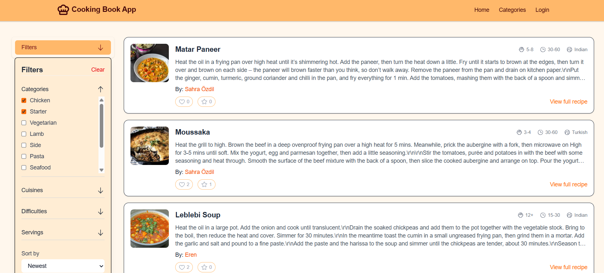

# Cooking Book Application

## Description

Cooking Book is a social recipe-sharing application built with **Next.js 15** and **TypeScript 5**.  
The app allows users to:

- Browse, view, and filter recipes by categories, cuisine, or difficulty.
- View detailed recipe pages with ingredients, instructions, and images.
- Follow other users and view their profiles to see their shared recipes.
- Share their own recipes with photos and step-by-step instructions.

The project leverages **Firebase Firestore** for database storage and **Next.js Server Components** for fetching data asynchronously, enabling fast and dynamic pages.

---

## Preview

  

---

## Features

- **Dynamic recipe pages** with detailed info and images.
- **Category and cuisine filtering**.
- **User profiles and social interactions**.
- **Firebase Firestore integration** for storing recipes and user data.
- **Optimized fonts and images** using Next.js built-in features.
- Fully responsive layout with Tailwind CSS.

---

## Tech Stack

- **Frontend:** Next.js 15, React, TypeScript 5, Tailwind CSS
- **Backend / Database:** Firebase Firestore
- **Image Optimization:** Next.js Image component
- **Authentication & Social Features:** Firebase Auth
- **Deployment:** Vercel

---

## Getting Started

### Install Dependencies

```bash
npm install
# or
yarn install
# or
pnpm install
```
### Run Development Server
```bash
npm run dev
# or
yarn dev
# or
pnpm dev
# or
bun dev
```
### Firebase Setup
- Create a Firebase project in Firebase Console
- Enable Firestore and optionally Authentication if using user accounts.
- Create a .env.local file in the root of the project:
```bash
NEXT_PUBLIC_FIREBASE_API_KEY=your_api_key
NEXT_PUBLIC_FIREBASE_AUTH_DOMAIN=your_project.firebaseapp.com
NEXT_PUBLIC_FIREBASE_PROJECT_ID=your_project_id
NEXT_PUBLIC_FIREBASE_STORAGE_BUCKET=your_project.appspot.com
NEXT_PUBLIC_FIREBASE_MESSAGING_SENDER_ID=your_messaging_sender_id
NEXT_PUBLIC_FIREBASE_APP_ID=your_app_id
```

### Formatting & Linting
```bash
npm run format
# or
yarn format
# or
pnpm format
```
This will automatically format your code using Prettier (or your configured formatter).
